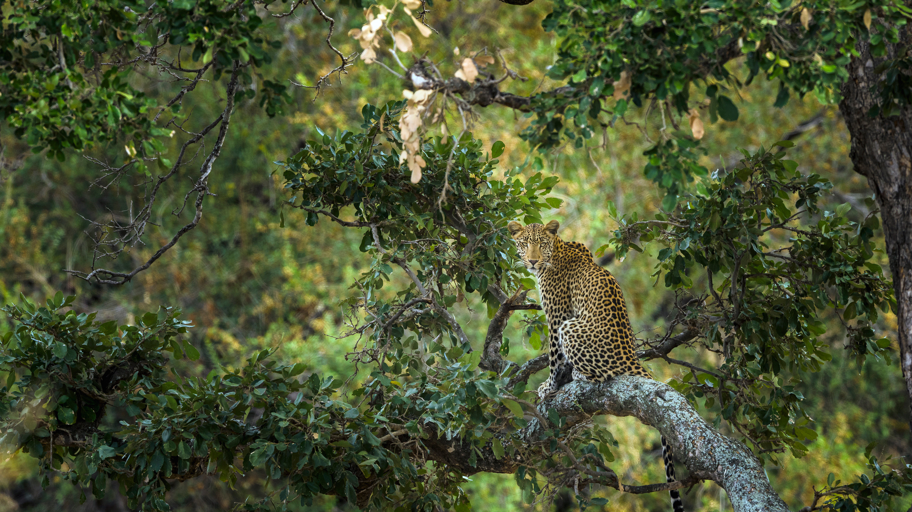

# Bing Wallpaper Archive

Use Github Action to automatically crawl bing daily wallpaper.

### List of Included Wallpapers

|date|title|copyright|
|---|---|---|
|20240303|一位浑身斑点的杂技演员|树上的豹子，克鲁格国家公园，南非 (© Tonino De Marco/Minden Pictures)|
|20240302|西西里岛的风光|莫迪卡，西西里岛，意大利 (© Sandro Bisaro/Getty Images)|
|20240301|蝶舞翩跹|德国草地上的蝴蝶 (© Albert Fertl/Getty Images)|
|20240229|多过一天|欧亚红松鼠 (© Westend61/Getty Images)|
|20240228|随波逐流|班堡城堡，诺森伯兰郡，英格兰 (© Blackbeck/Getty Images)|
|20240227|在冰天雪地里玩耍|玩耍的北极熊幼崽，卡克托维克，阿拉斯加州，美国 (© Piriya Photography/Getty Images)|
|20240226|深不见底的鸿沟|大峡谷国家公园，亚利桑那州，美国 (© Jeremy Janus/Getty Images)|
|20240225|薄雾笼罩|考伊琴山谷的薄雾，温哥华岛，加拿大不列颠哥伦比亚省 (© Kevin Oke/Alamy)|
|20240224|点亮一盏明灯，愿您万事顺意！|锦里街上悬挂的红色中国灯笼，成都，中国四川省 (© Philippe LEJEANVRE/Getty images)|
|20240223|老鹰起舞的地方|Haghartsin修道院，迪利扬国家公园，亚美尼亚 (© Alexey Kharitonov/Shutterstock)|
|20240222|名副其实的“调色板盒子”|布莱顿海滩的彩虹小屋，墨尔本，维多利亚州，澳大利亚 (© Prasit photo/Getty Images)|
|20240221|一个天然的矛盾体|火瀑布，优胜美地国家公园，加利福尼亚州，美国 (© Gregory B Cuvelier/Shutterstock)|
|20240220|一个供市民休闲娱乐的公园|Kinder Scout，峰区国家公园，英国 (© john finney photography/Getty Images)|
|20240219|一年四季都有鲜艳的色彩!|鸟瞰克鲁斯港色彩斑斓的房屋，特内里费岛，西班牙 (© Marco Bottigelli/Getty Images)|
|20240218|来一口新鲜空气|抹香鲸浮出水面，多米尼克 (© Franco Banfi/Minden Pictures)|
|20240217|自然奇景|多洛米蒂山的布莱耶斯湖，南蒂罗尔，意大利 (© Marco Bottigelli/Getty Images)|
|20240216|让每只鸟都有价值|一只雌性灰额主红雀栖息在德克萨斯州一株多刺仙人掌上，美国 (© outtakes/Getty Images)|
|20240215|河马日快乐！|河马妈妈和小河马，南卢安瓜国家公园，赞比亚 (© Nature Picture Library/Alamy Stock Photo)|
|20240214|更好地在一起|丹顶鹤向伴侣鞠躬，北海道，日本 (© Steve Bloom Images/Alamy Stock Photo)|
