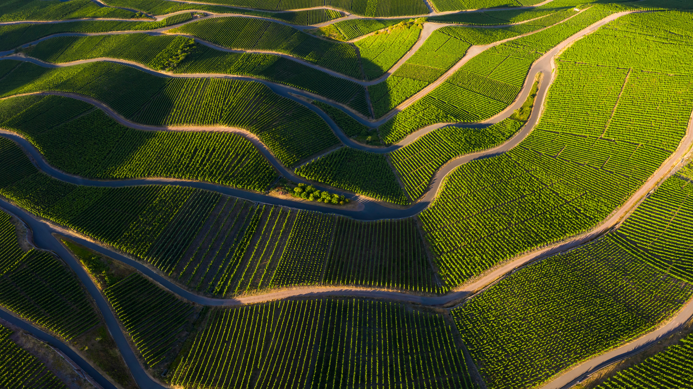

# Bing Wallpaper Archive

Use Github Action to automatically crawl bing daily wallpaper.

### List of Included Wallpapers

|date|title|copyright|
|---|---|---|
|20240727|完美的葡萄酒|摩泽尔河谷的葡萄园，莱茵兰-法尔茨，德国 (© Jorg Greuel/Getty Images)|
|20240726|比赛开始|塞纳河上的新桥，巴黎，法国 (© f11photo/Getty Images)|
|20240725|深入其中|大烟山国家公园的森林小道，田纳西州，美国 (© putmanphoto/Getty Images)|
|20240724|可爱的羊咩咩一家|北约克郡的黑面羊羊群，英格兰 (© R A Kearton/Getty Images)|
|20240723|历史的回响|迈索尼城堡，麦西尼亚州，希腊 (© Andrew Mayovskyy/Shutterstock)|
|20240722|和我一起避暑吧！|树上的中国小熊猫, 成都, 四川省, 中国 (© Jackyenjoyphotography/Getty Images)|
|20240721|香料岛之旅|肯杜瓦村的木制渔船，桑给巴尔，坦桑尼亚 (© Lubos Paukeje/Alamy Stock Photo)|
|20240720|到月亮上去|月球 (© Victor Blum/Getty Images)|
|20240719|巧妙的伪装|河岸上的一只年轻美洲虎，潘塔纳尔，巴西 (© Tambako the Jaguar/Getty Images)|
|20240718|意义深远|Coral reef in the Indian Ocean, Mayotte, France (© Gabriel Barathieu/Minden Pictures)|
|20240717|高耸入云的历史建筑|德国中世纪城市罗滕堡 (© kanuman/Getty Images)|
|20240716|挖掘过去|斯卡拉布雷的新石器时代遗迹,奥克尼群岛,苏格兰 (© Paul Williams - FunkyStock/Getty Images)|
|20240715|宁静惬意的海滨风光|立石公园，神奈川县，日本 (© blew_s/Shutterstock)|
|20240714|鲨鱼保护日|女王花园群岛的镰形真鲨，古巴 (© Christian Vizl/Tandem Stills + Motion)|
|20240713|快看，这是沉积岩哦|卡帕多西亚的童话烟囱和窑洞，土耳其 (© Storm Is Me/Shutterstock)|
|20240712|风雨无阻|雷尼尔山国家公园的野花，华盛顿州，美国 (© RomanKhomlyak/Getty Images)|
|20240711|你是81亿人口中的一员|甘吉，西西里岛，意大利 (© Andrea Caruso/Amazing Aerial Agency)|
|20240710|感恩的巨嘴鸟|领簇舌巨嘴鸟，哥斯达黎加 (© Juan Carlos Vindas/Getty Images)|
|20240709|千仞高壁|阿根廷拉里奥哈省塔兰帕亚国家公园 (© Gonzalo Azumendi/Getty Images)|
|20240708|一剂抗氧化剂|野生蓝莓 (© Baac3nes/Getty Images)|
|20240707|阳光下的梯田|越南安沛省木仓寨的水稻梯田 (© Kiatanan Sugsompian/Getty Images)|
|20240706|让我们扬帆起航！|从康威河眺望康威城堡，威尔士 (© David Chapman/Alamy Stock Photo)|
|20240705|邂逅美丽海岸线|丹翠雨林的诺亚海滩，昆士兰州，澳大利亚 (© bjeayes/Getty Images)|
|20240704|风景如画的白色小镇|扎哈拉德拉谢拉，安达卢西亚，西班牙 (© Francesco Carovillano/eStock Photo)|
|20240703|等等，谁在那儿？|猫鼬家族 (© anetapics/Shutterstock)|
|20240702|昔日城市的“灵魂”|意大利卡，桑蒂蓬塞的一座古罗马城市，塞维利亚，安达卢西亚，西班牙 (© Moses Palermo/Amazing Aerial Agency)|
|20240701|为加拿大干杯|菲斯加德灯塔，埃斯奎莫尔特港，科尔伍德，不列颠哥伦比亚省，加拿大 (© davemantel/Getty Images)|
|20240630|你不会忘记它的！|乌布寺庙的石雕,巴厘岛,印度尼西亚 (© R. Schönebaum/plainpicture)|
|20240629|只见树木，不见森林|宁哈根的山毛榉林，梅克伦堡-前波美拉尼亚州，德国 (© Martin Ruegner/Getty Images)|
|20240628|最具加勒比海风情的海岛|诺曼底海岸的绍塞群岛，法国 (© Tuul & Bruno Morandi/Getty Images)|
|20240627|“甜蜜的”穹顶|黄昏时分的圣母百花大教堂，佛罗伦萨，意大利 (© Elena Pueyo/Getty Images)|
|20240626|美丽的条纹小鱼！|考氏鳍竺鲷与海葵，蓝碧海峡，北苏拉威西，印度尼西亚 (© Constantinos Petrinos/NPL/Minden Pictures)|
|20240625|拍出炫酷照片的好地方|火浪岩层，火焰谷州立公园，内华达州，美国 (© Clint Losee/Tandem Stills + Motion)|
|20240624|让人心旷神怡的美景|克里穆图的火山口湖，弗洛勒斯岛，印度尼西亚 (© Shane P. White/Minden Pictures)|
|20240623|漆黑的夜晚，城市的灯光|达卡环形交叉路口的鸟瞰图，孟加拉国 (© Azim Khan Ronnie/Amazing Aerial Agency)|
|20240622|迷失在迷雾之中|亚马逊雨林，巴西 (© Claus Meyer/plainpicture)|
|20240621|清凉的湖水|蓝色水面上的渔船航拍图，郴州市，湖南省，中国 (© Haitong Yu/Getty images)|
|20240620|夏天的脚步近了|科基诺，古代巨石观测站，北马其顿 (© stoimilov/Shutterstock)|
|20240619|一座历史古迹|库克斯港的水塔，德国 (© Andreas Vogel/Alamy)|
|20240618|鲁冰花盛放的夏季|日出时的羽扇豆田和教堂，斯奈山半岛，冰岛 (© Matteo Colombo/Getty Images)|
|20240617|传播花粉|绿顶辉蜂鸟与巨型蓟，穆埃尔特山，哥斯达黎加 (© adrian hepworth/Alamy Stock Photo)|
|20240616|这位父亲棋高一着|赤狐父子，华盛顿，美国 (© Chase Dekker/Minden Pictures)|
|20240615|有志者事竟成|在纳扎雷冲浪的冲浪者，葡萄牙 (© Rui Caria/Getty Images)|
|20240614|孤独，但不寂寞|佩姬湾灯塔，新斯科舍省，加拿大 (© Pugalenthi/Getty Images)|
|20240613|瓷砖的故事|雷吉斯坦广场的外立面马赛克，撒马尔罕，乌兹别克斯坦撒 (© da-kuk/Getty Images)|
|20240612|星光盛宴|大弯国家公园上空的银河，得克萨斯州，美国 (© wisanuboonrawd/Adobe Stock)|
|20240611|这些羚羊是真正的珍宝|热带稀树草原上的南非剑羚，博茨瓦纳大草原 (© Karine Aigner/Tandem Stills + Motion)|
|20240610|比赛将在这里开始！|龙舟池日出，集美区，厦门，中国 (© outcast85/Getty images)|
|20240609|令人窒息的寂静|巴尔德纳斯雷亚尔斯自然公园，巴德纳斯，纳瓦拉，西班牙 (© Aliaume Chapelle/Tandem Stills + Motion)|
|20240608|河流的交汇|复活节溪和基利克河的交汇处，北极之门国家公园，阿拉斯加州，美国 (© Patrick J. Endres/Getty Images)|
|20240607|希望的浪潮|座头鲸家族，荷兰港，阿拉斯加州 (© Jude Newkirk/Amazing Aerial Agency)|
|20240606|有趣的野生动物!|蓬德高鸟类公园的大红鹳，卡玛格，法国 (© Yann Guichaoua-Photos/Getty Images)|
|20240605|世界环境日快乐！|马达加斯加的马苏阿拉国家公园 (© Dennis van de Water/Shutterstock)|
|20240604|物以类聚|黑胸蜂虎，巴迪亚国家公园，尼泊尔 (© PACO COMO/Shutterstock)|
|20240603|一起骑车去兜风吧|哥本哈根的自行车，丹麦 (© Alphotographic/Getty Images)|
|20240602|黑夜中的一盏明灯|普卢马纳克的灯塔，阿摩尔滨海省，法国 (© Christian Handl/Getty Images)|
|20240601|带你游花园|帝王棕榈树，里约热内卢植物园，巴西 (© Marcia Silva de Mendonca/Getty Images)|
|20240531|绿意盎然的宜人之地|冈纳塞德，斯韦尔代尔，约克郡谷地国家公园，英格兰 (© Derek Croucher/Alamy Stock Photo)|
|20240530|欢迎来到大沼泽地|一片斜纹松和锯齿草大沼泽地国家公园，佛罗里达州，美国 (© Jonathan Gewirtz/Tandem Stills + Motion)|
|20240529|水獭在看什么？|青春期的欧洲水獭，斯佩尔维湖，苏格兰姆尔斯岛 (© Neil Henderson/Alamy Stock Photo)|
|20240528|屹立于世界之巅|罗萨诺修道院，迈泰奥拉，色萨利 ，希腊 (© Marius Roman/Getty Images)|
|20240527|我们去乘船吧！|塞斯特里莱万特的沉默湾，利古里亚大区，意大利 (© StevanZZ/Getty Images)|
|20240526|野性与自由|香根和羽扇豆，梅索谷，北喀斯喀特，华盛顿州，美国 (© Alan Majchrowicz/Getty Images)|
|20240525|沙丘守护者|阿伊特本哈杜，摩洛哥 (© Grant Faint/Getty Images)|
|20240524|一路到顶峰|阿尼斯克洛峡谷，奥德萨和佩尔迪多山国家公园，韦斯卡，西班牙 (© Marisa Estivill/Shutterstock)|
|20240523|寻找一个“庇护所”|印度星龟，斯里兰卡 (© Robin Chittenden/Minden Pictures)|
|20240522|深入了解生物多样性|塔斯马尼亚高山黄桉（假少花桉），费尔德山国家公园，塔斯马尼亚州，澳大利亚 (© Ignacio Palacios/Getty Images)|
|20240521|充满茶香的一天|卡梅隆高地茶园，马拉西亚 (© alex cheong/Getty Images)|
|20240520|我简直不敢相信！|蜜蜂照料蜂巢 (© Simun Ascic/Alamy Stock Photo)|
|20240519|历史与大海的交汇处|韦尔纳扎村，五渔村，利古里亚，意大利 (© Roberto Moiola/Sysaworld/Getty Images)|
|20240518|流浪者未必都是迷路人|破碎群岛，环太平洋国家公园保护区，不列颠哥伦比亚省温哥华岛，加拿大 (© Ron Watts/Design Pics/Getty Images)|
|20240517|今天不是无关紧要的一天|塔兰吉雷国家公园的非洲象家族，坦桑尼亚 (© Vicki Jauron, Babylon and Beyond Photography/Getty Images)|
|20240516|这片水域里有很多故事！|维戈的兰德大桥，西班牙 (© Julio Conde/Getty Images)|
|20240515|迷失在蓝色的美丽国度|焦特布尔蓝色之城，印度 (© cinoby/Getty Images)|
|20240514|“深渊”探险|通往大房间的走道，卡尔斯巴德洞穴国家公园，新墨西哥州 (© Doug Meek/Getty Images)|
|20240513|鱼眼视角|鱼河大峡谷，纳米比亚 (© R. M. Nunes/Getty Images)|
|20240512|放牧和饲养|潘帕省草原上的雌性原驼和它新出生的宝宝，阿根廷 (© Gabriel Rojo/Minden Pictures)|
|20240511|小蓝鸟一路顺风|树枝上栖息的靛蓝彩鹀，德克萨斯州 (© Jeff R Clow/Getty Images)|
|20240510|岛屿在召唤！|米苏尔岛，拉贾安帕群岛，印度尼西亚 (© Giordano Cipriani/Getty Images)|
|20240509|恣意绽放的郁金香|埃米尔甘公园的郁金香，伊斯坦布尔，土耳其 (© Ozbalci/Getty Images)|
|20240508|海港景色|伊夫堡，马赛，法国 (© Sergii Figurnyi/Alamy)|
|20240507|水影里的小黄鸭|一只小鸭子在水草地上游泳，萨福克郡，英国 (© Nick Hurst/Getty Images)|
|20240506|峰区一瞥|罗奇斯山脊，英格兰峰区 (© George W Johnson/Getty Images)|
|20240505|为墨西哥干杯!|圣米格尔德阿连德的柱廊，瓜那华托州，墨西哥 (© Mint Images/Getty Images)|
|20240504|愿原力与你同在！|斯凯利格·迈克尔岛上一座古老修道院的废墟，爱尔兰 (© MNStudio/Getty Images)|
|20240503|最热的地方也有凉爽之处|春天盛开的沙漠毒菊，索诺拉沙漠，亚利桑那州 (© Charles Harker/Getty Images)|
|20240502|“月球一日游”|蓝龙熔岩流，月球陨石坑国家纪念碑和保护区，爱达荷州，美国 (© Alan Majchrowicz/Getty Images)|
|20240501|夏威夷的花环节|夏威夷花环 (© Jotika Pun/Shutterstock)|
|20240430|“草原大喵”的完美速度|清晨雨中的猎豹，恩杜图平原，恩戈罗恩戈罗保护区，坦桑尼亚 (© Paul Souders/Getty Images)|
|20240429|被保存得很好的古建筑|福建土楼，福建省历史文化遗产建筑，中国 (© Hongjie Han/Getty Images)|
|20240428|去公园走走吧！|瓜达卢佩山脉国家公园日出时的埃尔卡皮坦山，德克萨斯州，美国 (© Adam Mowery/Tandem Stills + Motion)|
|20240427|观鸟的时间到了！|澳大利亚花园里的白种安氏蜂鸟，加州大学圣克鲁兹分校植物园，加利福尼亚州，美国 (© yhelfman/Getty Images)|
|20240426|这棵树是个快乐的家伙！|卡拉洛奇树，又名生命之树，卡拉洛奇海滩，奥林匹克国家公园，华盛顿州，美国 (© Abbie Warnock-Matthews/Shutterstock)|
|20240425|很高兴在这里见到你们！|南极洲冰山上的阿德利企鹅 (© Patrick J. Endres/Getty Images)|
|20240424|嘿，今天长势如何？|盛开的白延龄草，安大略省，加拿大 (© Jun Zhang/Getty Images)|
|20240423|预订已满！|三一学院图书馆，都柏林，爱尔兰 (© Lukas Bischoff/Getty Images)|
|20240422|我们在庆祝什么?|绿海龟，圣地亚哥，加利福尼亚，美国 (© Ralph Pace/Minden Pictures)|
|20240421|未选择的路|Cades Cove ，大雾山国家公园，田纳西州，美国 (© Richard Bernabe/Shutterstock)|
|20240420|保存，保护，享受！|日出时分的大棱镜泉，美国怀俄明州黄石国家公园 (© XIN WANG/Getty Images)|
|20240419|历史的轮回|布罗德加环，奥克尼岛，苏格兰 (© Paul Williams - FunkyStock/Getty Images)|
|20240418|名誉之墙|中世纪城墙，阿维拉，西班牙 (© Scott Suriano/Getty Images)|
|20240417|我是不是睡得太久了？|春天的美洲黑熊幼崽，仙纳度国家公园，弗吉尼亚州，美国 (© Scott Suriano/Getty Images)|
|20240416|灯光，相机，纽约！|暮色中的曼哈顿下城联合广场，纽约，美国 (© Sean Pavone/Getty Images)|
|20240415|介于文艺复兴与独创性之间|香波城堡，中央-卢瓦尔河谷大区，法国 (© Susanne Kremer/eStock Photo)|
|20240414|岩石保龄球|保龄球海滩的日落，门多西诺县，加利福尼亚，美国 (© Melo Qiao/Getty Images)|
|20240413|花开正满枝|春天的苹果树，德国 (© Smileus/Getty Images)|
|20240412|一座天然拱门|拱门国家公园，犹他州，美国 (© Anthony Heflin/Shutterstock)|
|20240411|把梦想变成现实！|丘伦梅鲁瀑布鸟瞰图，委内瑞拉 (© AirPano LLC/Amazing Aerial Agency)|
|20240410|猫头鹰在你身边！|洞穴附近的穴小鸮雏鸟，怀俄明州，美国 (© Danita Delimont/Getty Images)|
|20240409|踮起脚尖，穿过郁金香|郁金香田，斯卡吉特山谷，华盛顿州，美国 (© Claudia Cooper/Getty Images)|
|20240408|闻闻春天的气息|欧洲刺猬在长满蒲公英的花园里，巴特德里堡，德国 (© Oksana Schmidt/Getty Images)|
|20240407|看，我是树枝整理师！|奇迹湖附近池塘里的北美海狸，德纳里国家公园，阿拉斯加州，美国 (© Paul Souders/Getty Images)|
|20240406|皇家景观|姬路城，姫路，兵库县，日本 (© Julian Elliott Photography/Getty Images)|
|20240405|潜入碧海|从国际空间站拍摄的巴哈马群岛 (© NASA)|
|20240404|沼泽地上的漫游者|红驴羚群穿越奥卡万戈三角洲的沼泽平原，博茨瓦纳 (© Ibrahim Suha Derbent/Getty Images)|
|20240403|希望彩虹留在这里|At-Bashy地区的彩虹，Kakshaal Too山脉，纳伦省，吉尔吉斯斯坦 (© Emad aljumah/Getty Images)|
|20240402|一缕阳光下的林地|日德兰半岛的山毛榉树和野生海葵 ，丹麦 (© Nick Brundle Photography/Getty Images)|
|20240401|岌岌可危的冰川|勃朗峰上的冰海，夏慕尼，法国 (© Hagenmuller Jean-François/Hemis/Alamy)|
|20240331|纯洁与优雅的象征|潘塔纳尔湿地的大白鹭，巴西 (© Geraldi Corsi/Getty Images)|
|20240330|来自“颠倒世界”的问候|睡在号角树上的褐喉树懒，哥斯达黎加 (© Juan Carlos Vindas/Getty Images)|
|20240329|潮涨潮落，灯火通明|日落时的南斯塔克灯塔，霍利希德，威尔士，英国 (© mariotlr/Getty Images)|
|20240328|花香满径|上海的樱花，中国 (© Yaorusheng/Getty Images)|
|20240327|戏剧成为关注的焦点|布宜诺斯艾利斯哥伦布剧院，阿根廷 (© Wei Hao Ho/Alamy Stock Photo)|
|20240326|潮汐探戈|海水从古老的珊瑚礁上倾泻而下，杭莱，越南 (© Thang Tat Nguyen/Getty Images)|
|20240325|春意盎然|弗雷泽河谷的郁金香田，阿伯兹福德，不列颠哥伦比亚省，加拿大 (© LeonU/Getty Images)|
|20240324|你能挪过去一点吗?|樱花树枝上的灰胸绣眼鸟，韩国 (© TigerSeo/Getty Images)|
|20240323|造雾|巴西亚马逊上空巨大的砧状云 (© NASA)|
|20240322|我们在庆祝“水”？|蓝泉，蒂怀霍步道，新西兰 (© Ian Beattie/Alamy Stock Photo)|
|20240321|森林多美好呀！|布恩迪国家公园，乌干达 (© Art Wolfe/DanitaDelimont.com)|
|20240320|粉嫩的春日美景|鸟瞰春日盛开的樱花，中国 (© outcast85/Getty images)|
|20240319|春日私语|盛开的扁桃树, 加利福尼亚州，美国 (© Jeffrey Lewis/Tandem Stills + Motion)|
|20240318|温柔的“沙丘巨人”|大象岩，古城欧拉，沙特阿拉伯 (© Lubo Ivanko/Shutterstock)|
|20240317|今天，让我们穿绿衣裳吧！|圣菲尼安湾，凯里郡，爱尔兰 (© Atlantide Phototravel/Getty Images)|
|20240316|被竹子包围了|正在吃竹子的大熊猫，中国成都 (© Suzi Eszterhas/Minden Pictures)|
|20240315|一抹春色|安沙波利哥沙漠州立公园，美国加利福尼亚州 (© Stephen Matera/Tandem Stills + Motion)|
|20240314|一个π|Wat Phra Ngam，大城府历史公园，泰国 (© boonchai wedmakawand/Alamy Stock Photo)|
|20240313|鸟瞰|小红鹳飞越马加迪湖,肯尼亚 (© Vicki Jauron, Babylon and Beyond Photography/Getty Images)|
|20240312|峡谷的守护者|布莱斯峡谷国家公园，犹他州，美国 (© Jim Patterson/Tandem Stills + Motion)|
|20240311|醉人的山峦|Prosecco山丘，科内利亚诺和瓦尔多比亚德内，威内托大区，意大利 (© Richard T. Nowitz/Getty Images)|
|20240310|是时候调整时间了|圣哈辛托大厦的机械钟，博蒙特，美国德克萨斯州 (© Richard T. Nowitz/Getty Images)|
|20240309|因时间而改变|比斯第恶土，新墨西哥州，美国 (© Ian Shive/Tandem Stills + Motion)|
|20240308|世界新七大自然奇观之一|伊瓜苏大瀑布鸟瞰图，巴西 (© Nido Huebl/Shutterstock)|
|20240307|攀登新的高峰|Roques de Benet，埃尔斯港自然公园，加泰罗尼亚，西班牙 (© Sergi Boixader/Alamy Stock Photo)|
|20240306|尽情地嬉戏玩水吧！|Wahclella Falls，哥伦比亚河峡谷，俄勒冈州，美国 (© Eric Vogt/Tandem Stills + Motion)|
|20240305|陷入循环之中？|曼谷的交通圈和高速公路，泰国 (© Avigator Fortuner/Shutterstock)|
|20240304|睡美人|从蒙特维多看到的阿雷纳尔火山,哥斯达黎加 (© Lukas Bischoff/Getty Images)|
|20240303|一位浑身斑点的杂技演员|树上的豹子，克鲁格国家公园，南非 (© Tonino De Marco/Minden Pictures)|
|20240302|西西里岛的风光|莫迪卡，西西里岛，意大利 (© Sandro Bisaro/Getty Images)|
|20240301|蝶舞翩跹|德国草地上的蝴蝶 (© Albert Fertl/Getty Images)|
|20240229|多过一天|欧亚红松鼠 (© Westend61/Getty Images)|
